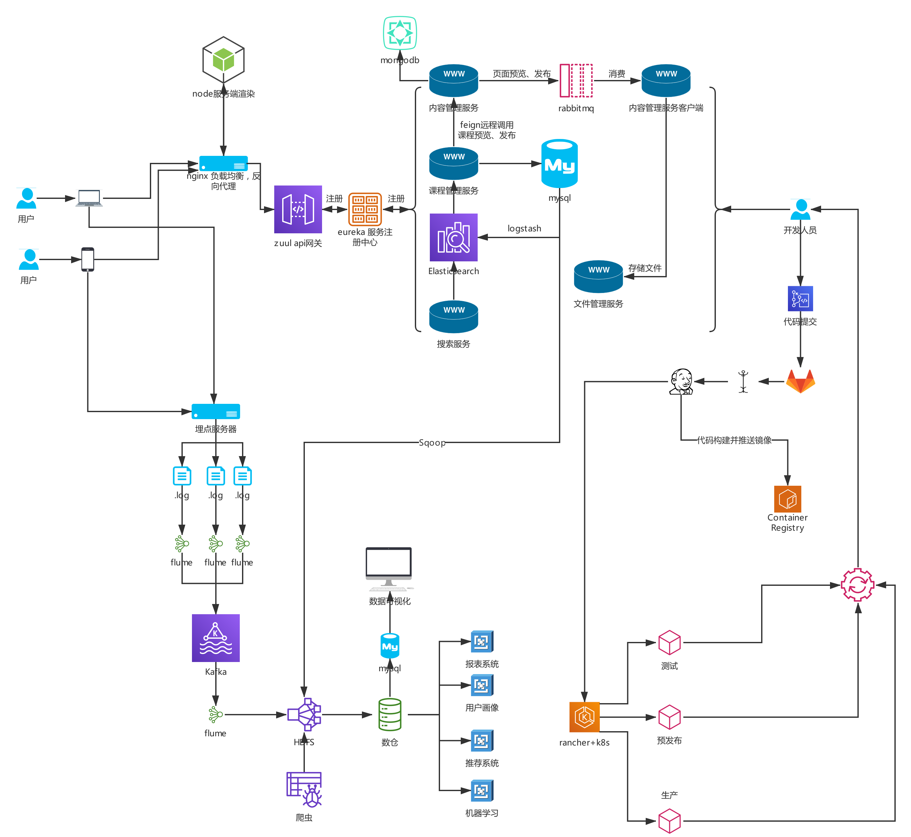
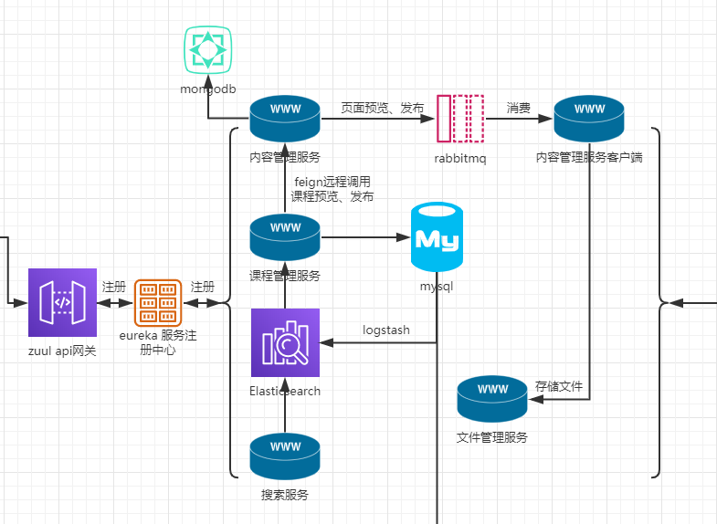
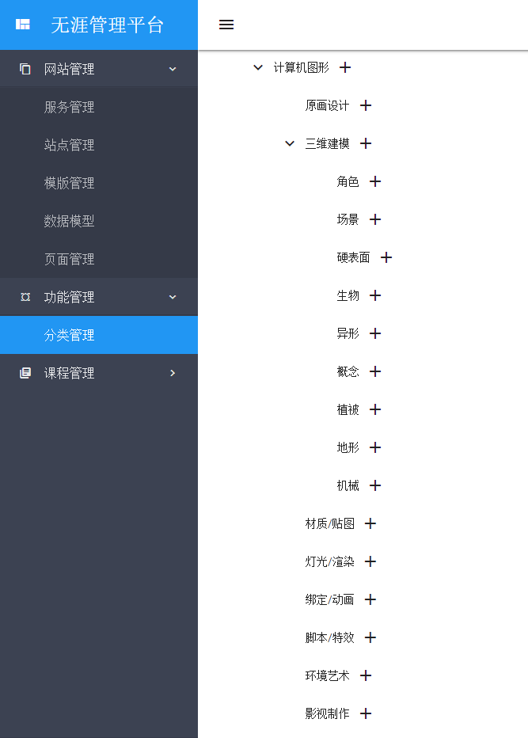
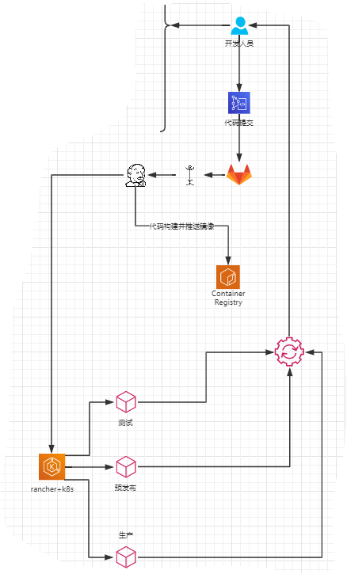
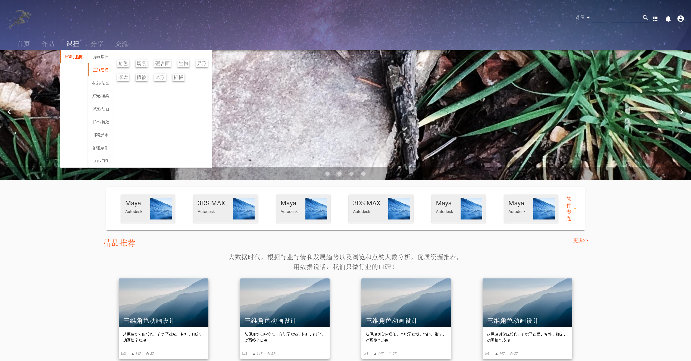
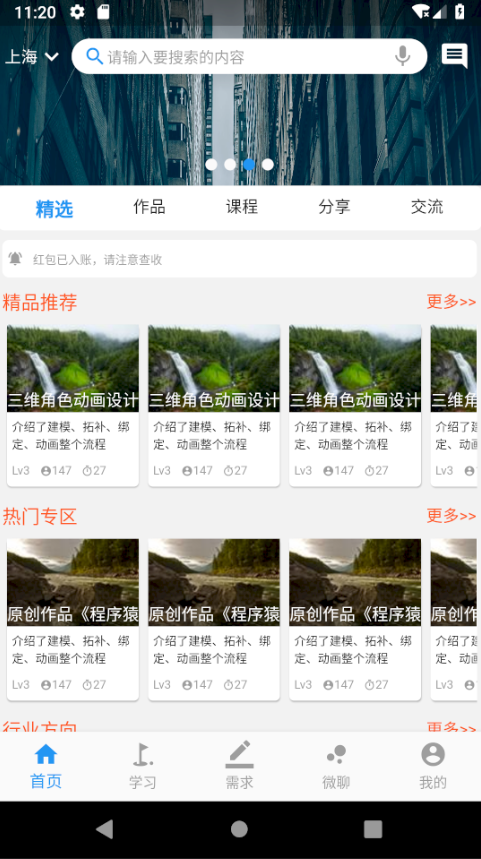
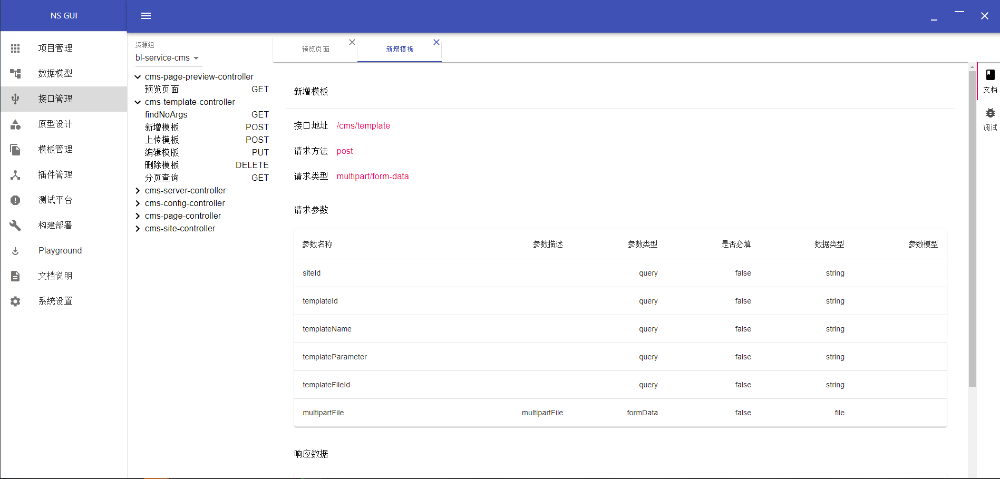

# 背景

由于目前多端分离架构的盛行，在实际工作中开发人员往往都是局部负责自己开发的那部分需求，很难有机会接触到其他系统的开发知识，也就没有对全局架构有很好的认知，所以这会局限个人的成长，不利于职业发展和职业的多元性。出于学习的目的和技术积累，创造更多的职业可能性，所以产生了本探索性案例。

# 案例介绍

本案例是较综合性的项目，主要包含了微服务、前端、大数据和 DevOps 等几个部分，大体上覆盖了一条项目从开发到发布的产线，基本上形成了一个数据闭环和开发闭环，涉及到的知识点较多，是比较好的学习案例。

# 总架构

# 微服务

## [项目](https://github.com/nixstack/bl-manager.git)

## 概览

微服务框架采用的是 Spring Cloud + Spring Boot 栈

## 特点

- 统一 API 网关 [图](img/eureka.PNG)
- API 文档聚合 [图](img/swagger.PNG)
- Feign 服务间远程调用
- MongoDB GridFS 模板文件管理
- FastDFS 分布式文件存储
- RabbitMQ 异步消息通信机制
- Elasticsearch + Logstash 搜索服务
- mybatis+spring jpa 数据持久化

# 管理平台

采用 angular 框架，并结合 material 材质设计

## [项目](https://github.com/nixstack/bl-manager-web.git)

## 概览

## 特点

- Angular + Material
- 模块化+组件化

# 大数据

通过埋点方式进行数据上报，由 flume+kafka 通过日志服务器采集数据，存储到 hdfs，流向数仓，经过抽取、清洗产生有价值的数据。

## [项目](https://github.com/nixstack/bl-data-platform.git)

## 概览

# DevOps

## 概览

# 前端

采用 Vue + Nuxt 技术实现服务端渲染

## [项目](https://github.com/nixstack/bl-portal.git)

## 概览

## 特点

- 服务端渲染
- 组件化
- Vuetify UI 框架，响应式
- Easy Mock 结合 swagger，开发阶段 mock 数据

# APP

基于 Flutter 开发的跨平台 APP

## [项目](https://github.com/nixstack/bl_app_flutter.git)

## 概览

# 开发者图形化管理工具

基于 Electron+React+Material-UI+Mongodb...开发

## [项目](https://github.com/nixstack/ns-gui.git)

## 概览

# 未完，待续...
